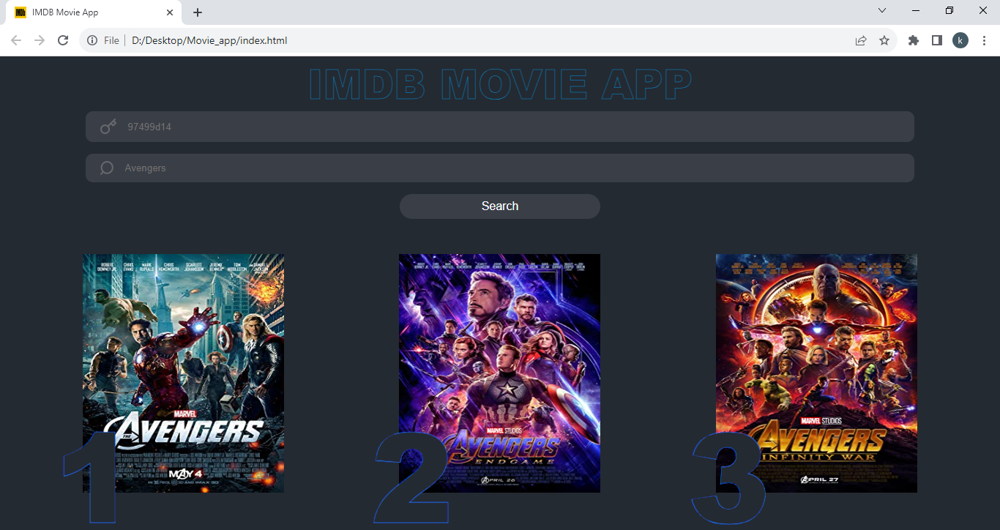

@khan imran

# Movie_App

# Movie Search App

This is a web app that allows you to search for movies and view their details using the [OMDb API]. You can enter any movie/series title in the search box and get a list of matching results. Each result shows the movie poster, title, year. 
You can also click on any result to see more information about the movie.

## Features

- The app is built with HTML, CSS, and JavaScript.
- The app uses the [fetch API](https://developer.mozilla.org/en-US/docs/Web/API/Fetch_API) to make requests to the 
 OMDb API and get movie data in JSON format.
- The app handles errors in data fetching and displays a message if the request fails or no results are found.
- The app handles cases where the movie poster is not available and displays a placeholder image instead.

## How to run

You need to get an API key from the [OMDb API](https://www.omdbapi.com/apikey.aspx)and use it in API key section.

Preview:

